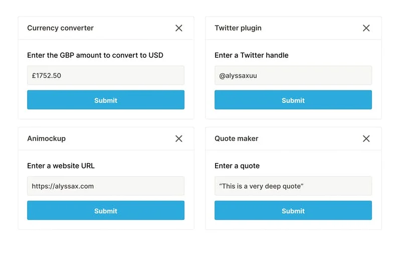
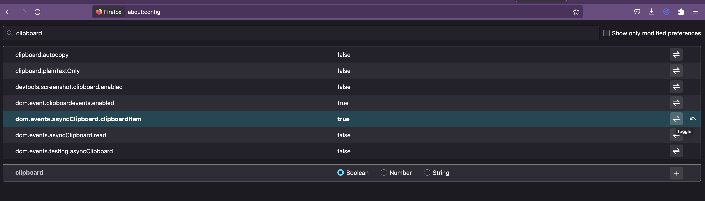

# Slashy


<br>
<br>
Supercharge Notion with custom commands to record, draw, and more ✨

Slashy is an open source extension that lets you create custom commands for Notion. Make camera and audio recordings, draw, create reusable components and much more - all for free.

👉 Get it now [for Chrome](https://chrome.google.com/webstore/detail/ccjlpkignaedigchcklcipfbecijllca) and [for Firefox](https://addons.mozilla.org/en-US/firefox/addon/slashy/)

<a href="https://www.producthunt.com/posts/slashy?utm_source=badge-top-post-badge&utm_medium=badge&utm_souce=badge-slashy" target="_blank"></a>

Made by [Alyssa X](https://twitter.com/alyssaxuu)

## Table of contents

- [Features](#features)
- [How to use Slashy](#how-to-use-slashy)
	- [Firefox workaround](#firefox-workaround)
	- [Accessing the sidebar](#accessing-the-sidebar) 
	- [The draw command](#the-draw-command)
	- [The record command](#the-record-command)
	- [Creating a command](#creating-a-command)
	- [Editing a command](#editing-a-command)
	- [Deleting a command](#deleting-a-command)

- [Slashy SDK](#slashy-sdk)
 - [Show modal]($show-modal)
 - [Write to Notion](#write-to-notion)
 - [Add image](#add-image) 
- [Self-hosting Slashy](#self-hosting-slashy)
	- [Installing on Chrome](#installing-on-chrome)
	- [Installing on Firefox](#installing-on-firefox) 
- [Libraries used](#libraries-used)

## Features

⚡️ Create your own Notion custom commands, accessible with the slash key<br>
📹 Make video and audio recordings without leaving Notion with /record<br>
🖌️ Make drawings and annotations for your Notion page with /draw<br>
✍️ Easily make commands for reusable blocks and content<br>
🤖 Develop your own plugins with the Slashy SDK<br>
🗄 Manage and edit your commands easily through the Notion sidebar<br>
⚙️ Toggle command visibility and other settings<br>
...and much more - all for free & no sign in needed!<br>

## How to use Slashy
First, you need to install Slashy from the [Chrome Web Store](https://chrome.google.com/webstore/detail/ccjlpkignaedigchcklcipfbecijllca), the [Firefox add-ons website](https://addons.mozilla.org/en-US/firefox/addon/slashy/), or [self-host it](#self-hosting-slashy).

### Firefox workaround
In order for the /draw command to work in Firefox, you must go to about:config in Firefox (type in the address bar) and then set `dom.events.asyncClipboard.clipboardItem` to true by clicking on the toggle button on the right. See below:<br><br>


### Accessing the sidebar
You can then open [Notion](https://notion.so), and you will see a "zap" icon on the top right of the sidebar. Click it to see and manage all the custom commands. Here's how it should look like after installing the extension:<br><br>


### The draw command
One of the default commands Slashy comes with is **/draw**.

Once you use it in Notion (typing /draw, and then selecting "Make a drawing" from the list), it will prompt a popup with a canvas you can draw on. Here are the tools available within it:

- **Color picker**: Clicking on the bottom left colored circle lets you switch the color you draw in.
- **Pencil tool**: Simple pencil drawing tool
- **Line tool**: Lets you create lines by dragging on the canvas
- **Text tool**: Lets you create text by clicking somewhere on the canvas, and then typing
- **Eraser**: Allows you to erase parts of the canvas by dragging on top of it, like a brush
- **Clear**: Clicking on it will automatically clear the canvas

Once you're happy with your drawing, you can click on "Save", and it will automatically be added into the Notion page.

### The record command
One of the default commands Slashy comes with is **/record**.

To use it in Notion, just type /record and select "Make a recording" from the list. It will prompt a popup, and ask you permission to use the camera and microphone. You need to accept to proceed.

Once the permissions have been set, you will see the camera playback within the popup, and you can click on the red circle to start recording. To stop, just click again, and it will automatically download the file. You can then add it into Notion.

### Creating a command
To create a command, click on the blue "New command" button on the top right of the sidebar. This will prompt a popup, that will look like this:<br><br>


There are several fields in the form:
|**Field**| **Type** | **Description** |
|--|--|--|
| `Image URL` | *URL (optional)* | A permanent link to an image to use as a thumbnail for the command. If not set, a fallback image will be used. |
| `Name` | *String* | The name of the command. This will be visible in the commands list and will be used as a [modal title for plugins](#show-modal). |
| `Description` | *String* | The description of the command. It will be visible in the commands list. |
| `Command` | *String* | The alias that will trigger the command. It will always use a "/" to trigger, like other Notion commands. |
| `Type of action` | *Dropdown* | The type of action the command will perform. It can be a "Template", which inserts markdown directly into the page, a "Script", which runs JavaScript code, or an "Image", which inserts an image into the page using a URL |
| `Visibility` | *Dropdown* | It can either be "Visible" or "Hidden", so you can control if the command shows up when using the "/". |
| `Template content` | *String* | Only shows if the command type is set to "Template". Any text (markdown supported) will be inserted into the Notion page. |
| `Image link` | *URL* | Only shows if the command type is set to "Image". The URL provided will be used to insert an image into the page. |
| `JavaScript` | *JavaScript* | Only shows if the command type is set to "Script". The JavaScript code will run after triggering the command. You can use the [Slashy SDK](#slashy-sdk) to access special methods to interact with Notion. |

### Editing a command
To edit a command, hover over a specific command in the sidebar (the record and draw commands cannot be edited), and click on the "Edit" button. It will show a popup where you can make any changes or discard them.

### Deleting a command
To delete a command, hover over a specific command in the sidebar (the record and draw commands cannot be deleted), and click on the trash button. It will prompt you with a popup to confirm whether you really want to remove the command. Click on "Delete" to confirm.


## Slashy SDK

I've added a few methods to make it easier to interact with Notion and create custom plugins in Slashy. You can use these methods in the Javascript field when creating a new command (make sure to set the command type to "Script").

### Show modal
```javascript
showModal(label, placeholder, onsubmit)
```
Displays a modal with an input field that you can use for a variety of plugins, for example:


The title of the modal will be the same as the name of your command.

|**Parameter**| **Type** | **Description** |
|--|--|--|
| `label` | *String* | The label that will show on the modal above the input. |
| `placeholder` | *String* | The placeholder text in the input. |
| `onsubmit` | *Function(result)* | The function that gets called when the user submits the modal. Should have one parameter to return the input value. |

### Write to Notion
```javascript
writeToNotion(content)
```
Inserts any sort of text (markdown included) into Notion where the user triggered the slash command.

|**Parameter**| **Type** | **Description** |
|--|--|--|
| `content` | *String* | The text to add to the Notion page. |

### Add image
```javascript
addImageBlob(blob)
```
Adds an image to the Notion page where the user triggered the slash command.

|**Parameter**| **Type** | **Description** |
|--|--|--|
| `blob` | *Blob (type `image/png` only)* | The image to add to the Notion page. |

Feel free to suggest new methods for Slashy by [making an issue](https://github.com/alyssaxuu/slashy/issues/new).

## Self-hosting Slashy
You can run Slashy locally without having to install it from the Chrome Store or from Firefox Add-ons.

### Installing on Chrome

1. Download the code. In the web version of GitHub, you can do that by clicking the green "Code" button, and then "Download ZIP".
2. Go to chrome://extensions/ in your browser, and [enable developer mode](https://developer.chrome.com/docs/extensions/mv2/faq/#:~:text=You%20can%20start%20by%20turning,a%20packaged%20extension%2C%20and%20more.).
3. Drag the [mv3 folder](https://github.com/alyssaxuu/slashy/tree/master/mv3) (make sure it's a folder and not a ZIP file, so unzip first), or click on the "Load unpacked" button and locate the folder.
4. That's it, you will now be able to use Slashy locally.

### Installing on Firefox

1. Download the code. In the web version of GitHub, you can do that by clicking the green "Code" button, and then "Download ZIP".
2. Open the about:debugging page in your browser, click the "This Firefox" option.
3. Click the "Load Temporary Add-on" button, and select any file inside the [mv2 folder](https://github.com/alyssaxuu/slashy/tree/master/mv2)
4. You might need to add a [temporary extension ID](https://developer.mozilla.org/en-US/docs/Mozilla/Add-ons/WebExtensions/manifest.json/browser_specific_settings#extension_id_format) in the manifest.json in order to be able to use storage. 
5. In order for the /draw function to work properly, you must go to about:config in Firefox (type in the address bar), and then set `dom.events.asyncClipboard.clipboardItem` to true by clicking on the toggle button on the right. See below:

6. That's it, you will now be able to use Slashy locally.

## Libraries used

- [jQuery](https://jquery.com/) - for better event handling and DOM manipulation
- [FabricJs](http://fabricjs.com/) - for the drawing plugin
- [SvalJs](https://github.com/Siubaak/sval) - to be able to execute custom scripts (eval doesn't work in MV3)

#

Feel free to reach out to me through email at hi@alyssax.com or [on Twitter](https://twitter.com/alyssaxuu) if you have any questions or feedback! Hope you find this useful 💜
